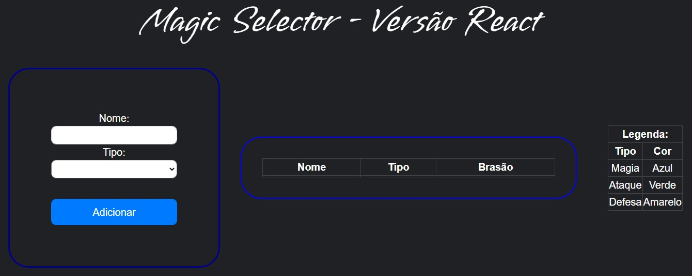

# Magic Selector

> 🚀 Projeto desenvolvido em React com objetivo de explorar melhor essa lib e possibilitando a aplicação em coding Dojo.

<p align="center">
 <a href="#demonstracao">Demonstração</a> •
 <a href="#pre-requisitos">Pré requisitos</a> •
 <a href="#executando">Executando o projeto</a> • 
 <a href="#tecnologias">Tecnologias</a> • 
 <a href="#autor">Autor</a> • 
 <a href="#contribuicao">Contribuição</a>
</p>

[### 🚧  Magic Selector 🚀 Em construção...  🚧](#demonstracao)



> 📋 Insira um nome e um tipo para preencher uma tabela que definirá a sua cor de brasão de acordo com o tipo inserido.

[### ⚙️ Pré-requisitos](#pre-requisitos)

Antes de começar, você vai precisar ter instalado as seguintes ferramentas:
[Git](https://git-scm.com), [Node.js](https://nodejs.org/en/). 
Opcionalmente você pode usar o editor de código [VSCode](https://code.visualstudio.com/)

[### 🎲 Executando o projeto](#executando)

```bash
# Clone este repositório
$ git clone <https://github.com/GuilhermeAFerrari/Magic-Selector.git>

# Acesse a pasta do projeto no terminal/cmd
$ cd magic-selector

# Instale as dependências
$ npm install

# Execute a aplicação em modo de desenvolvimento
$ npm run

# O servidor inciará na porta:3000 - acesse <http://localhost:3000>
```

[### 🛠 Tecnologias](#tecnologias)

As seguintes ferramentas foram usadas na construção do projeto:

- [React](https://pt-br.reactjs.org/)

[### 😎 Autor](#autor)

Guilherme Ferrari - guile.ferrari@hotmail.com

[](https://www.linkedin.com/in/guilherme-antonio-ferrari/)

[### 🎯 Contribuição](#contribuicao)

1. Faça o _fork_ do projeto
2. Crie uma _branch_ para sua modificação (`git checkout -b feature/descricaoFeature`)
3. Faça o _commit_ (`git commit -am 'Add descricaoFeature'`)
4. _Push_ (`git push origin feature/descricaoFeature`)
5. Crie um novo _Pull Request_

[npm-image]: https://img.shields.io/npm/v/datadog-metrics.svg?style=flat-square
[npm-url]: https://npmjs.org/package/datadog-metrics
[npm-downloads]: https://img.shields.io/npm/dm/datadog-metrics.svg?style=flat-square